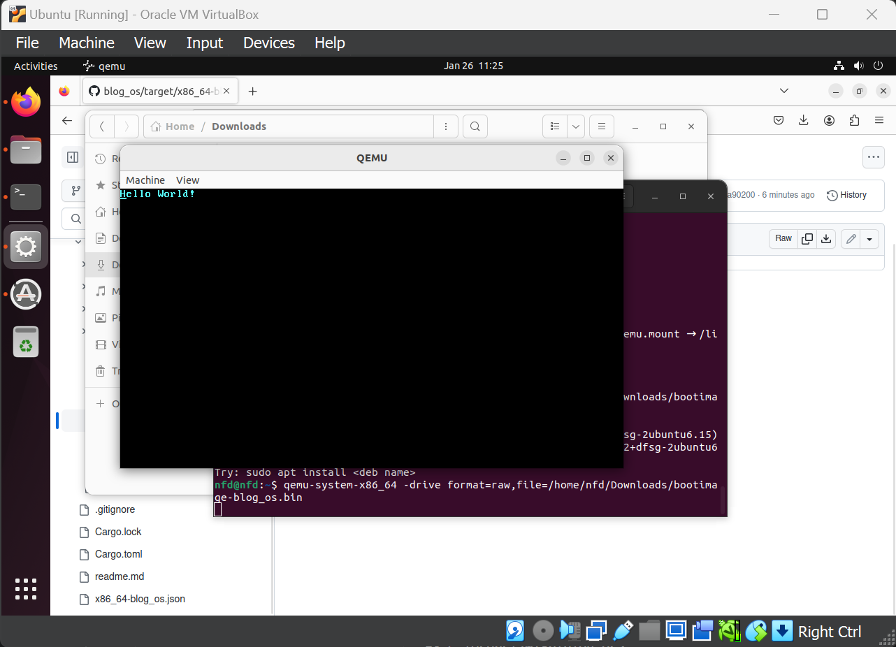

using 2018 edition

rustc 1.75.0-nightly

bootloader = "0.9.8"

Using ubuntu to use qemu to be able to open the bin file: > qemu-system-x86_64 -drive format=raw,file=target/x86_64-blog_os/debug/bootimage-blog_os.bin

